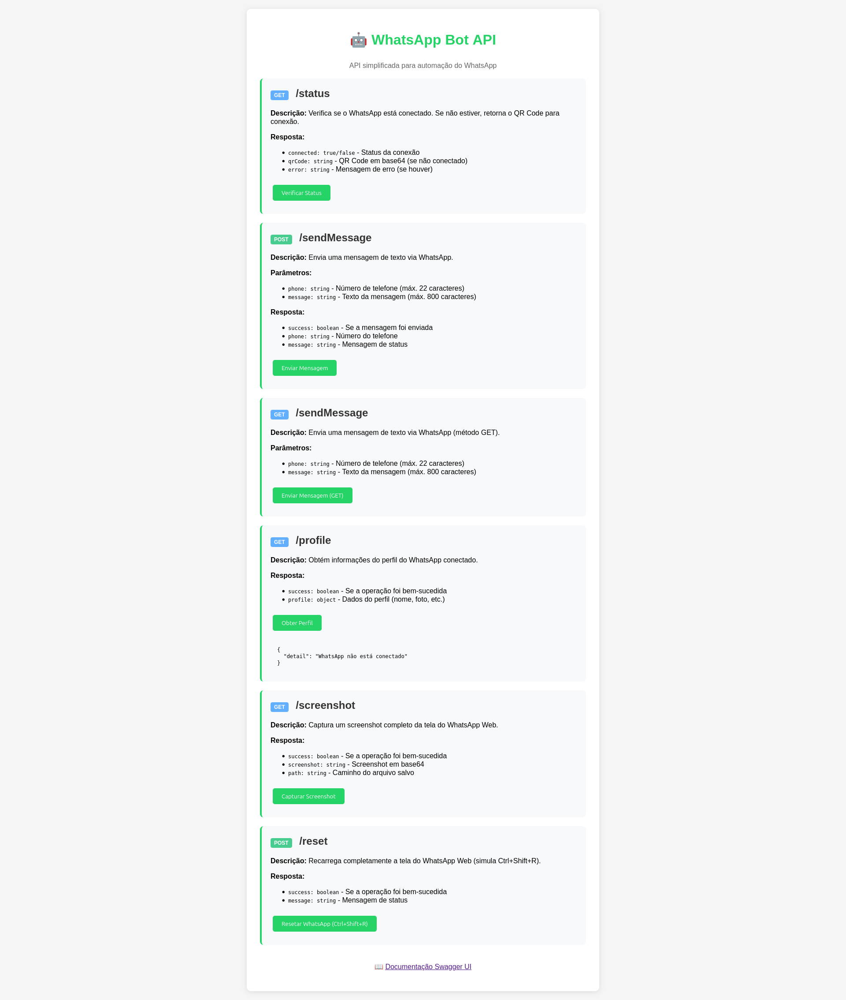

<p align="right">
  <a href="README.md"></a>
  <a href="README.pt-br.md"></a>
  <a href="README.es.md"></a>
</p>

# WhatsApp Bot API - FastAPI

Este proyecto fue migrado de Flask a FastAPI para mejorar el rendimiento y proporcionar documentación automática de la API.

## Cambios Principales

- **Framework**: Migrado de Flask a FastAPI
- **Archivo principal**: `main.py` (anteriormente `app.py`)
- **Documentación**: Swagger UI automática disponible en `/docs`
- **Validación**: Modelos Pydantic para validación de datos
- **Rendimiento**: Mejor rendimiento con FastAPI

## Endpoints Disponibles

### GET /
- Página inicial con documentación de la API

### POST /sendText
- Envía mensaje de texto por WhatsApp
- Parámetros: `phone` (string, máx 22 caracteres), `text` (string, máx 800 caracteres)

### GET /sendText
- Envía mensaje de texto por WhatsApp (método GET)
- Parámetros: `phone` (string, máx 22 caracteres), `text` (string, máx 800 caracteres)

### POST /sendMultText
- Envía mensaje con URL por WhatsApp
- Parámetros: `phone` (string, máx 22 caracteres), `text` (string, máx 800 caracteres)

### GET /sendMultText
- Envía mensaje con URL por WhatsApp (método GET)
- Parámetros: `phone` (string, máx 22 caracteres), `text` (string, máx 800 caracteres)

## Pantallas del Sistema

### Pantalla Home



### Pantalla Swagger

Accede a la documentación interactiva de la API (Swagger UI) en [`/docs`](http://localhost:8000/docs):


## Documentación de la API

Accede a `/docs` para ver la documentación interactiva de la API (Swagger UI).

## Ejecución

### Con Docker Compose
```bash
docker compose up --build
```

### Localmente
```bash
pip install -r IaC/flask/requirements.txt
uvicorn main:app --host 0.0.0.0 --port 8000
```

## Estructura del Proyecto

```
├── main.py                 # Aplicación principal FastAPI
├── datasource/            # Módulos de datos
├── static/               # Archivos estáticos
├── templates/            # Plantillas HTML
├── IaC/flask/           # Configuración Docker
│   ├── Dockerfile
│   ├── requirements.txt
│   └── entry_point.sh
└── docker-compose.yml
```

## Variables de Entorno

Configura las siguientes variables en el archivo `.env`:

- `MONGO_USER`: Usuario de MongoDB
- `MONGO_PASSWORD`: Contraseña de MongoDB
- `MONGO_DB`: Nombre de la base de datos
- `FASTAPI_PORT`: Puerto de la aplicación (por defecto: 8000)
- `FASTAPI_NAME`: Nombre del contenedor (por defecto: fastapi-app)

### Configuración Inicial

1. Copia el archivo de ejemplo:
```bash
cp env.example .env
```

2. Edita el archivo `.env` con tus configuraciones:
```bash
nano .env
```

3. Ejecuta el proyecto:
```bash
docker compose up --build
```

---

## Contacto

Desarrollado por **Victor Luis Santos**  
[LinkedIn](https://br.linkedin.com/in/victor-luis-santos)